# Authentication Packages Monorepo

This monorepo contains four TypeScript libraries for authentication and authorization workflows, designed to be modular and composable for modern web applications. Each package serves a distinct purpose and can be used independently or together.

## Packages Overview

- **auth-bff-client**: Client-side SDK for interacting with the Auth BFF (Backend For Frontend).
- **auth-bff-core**: Core logic, types, and adapters for authentication flows.
- **auth-bff-hono**: Hono.js middleware and utilities for building authentication-enabled APIs.
- **auth-bff-react**: React context provider and hooks for integrating authentication in React apps.

### Package Dependencies


---

## 1. auth-bff-client

**Purpose:**
Provides a TypeScript/JavaScript client for interacting with the Auth BFF API from frontend applications.

**Key Methods:**
- `createAuthClient(config)`: Factory function that returns a client instance.
- `signIn(email, password)`: Initiates login flow.
- `signOut()`: Logs out the current user.
- `getSession()`: Retrieves the current session or user info.
- `fetchWithAuth(url, options)`: Fetch wrapper that includes credentials and CSRF tokens.
- `setUnauthorizedHandler(callback)`: Sets a handler for 401 responses.

**How to Use:**
```ts
import { createAuthClient } from '@fbenaven/auth-bff-client';

const authClient = createAuthClient({ baseUrl: 'https://api.example.com' });

await authClient.signIn(email, password);
const session = await authClient.getSession();
await authClient.signOut();
```

**Typical Use Cases:**
- Authenticating users from a SPA or mobile app.
- Managing session state on the client.

### Client Authentication Flow


---

## 2. auth-bff-core

**Purpose:**
Contains the core authentication logic, shared types, and adapters for different auth providers (e.g., Supabase).

**Key Methods & Modules:**
- `adapters/`: Pluggable adapters for different backends (e.g., Supabase).
- `crypto/session.ts`: Utilities for session encryption and decryption using Web Crypto API.
  - `encrypt(data, secretHex)`: Encrypts session data with AES-GCM.
  - `decrypt(encryptedBase64, secretHex)`: Decrypts session data.
- Shared types for users, sessions, and tokens.

**How to Use:**
```ts
import { encrypt, decrypt } from '@fbenaven/auth-bff-core';
import { supabaseAdapter } from '@fbenaven/auth-bff-core';

const encrypted = await encrypt(sessionData, secretKey);
const decrypted = await decrypt(encryptedToken, secretKey);
```

**Typical Use Cases:**
- Building custom authentication flows.
- Integrating with different identity providers.

### Core Encryption Flow


---

## 3. auth-bff-hono

**Purpose:**
Provides Hono.js middleware and utilities for securing API routes, handling CSRF, JWT, RBAC, and routing.

**Key Methods & Modules:**
- `csrfMiddleware()`: CSRF protection middleware.
- `jwtMiddleware()`: JWT validation middleware.
- `rbacMiddleware(options)`: Role-based access control middleware.
- `setupAuthRoutes(app)`: Sets up auth routes (login, logout, session).
- Supporting utilities: `generateCsrfToken()`, JWT verification functions.

**How to Use:**
```ts
import { csrfMiddleware, jwtMiddleware, setupAuthRoutes } from '@fbenaven/auth-bff-hono';
import { Hono } from 'hono';

const app = new Hono();
app.use(csrfMiddleware());
app.use('/api/*', jwtMiddleware());
setupAuthRoutes(app);
```

**Typical Use Cases:**
- Securing API endpoints in a Hono.js server.
- Adding authentication and authorization to microservices.

### Backend Middleware Chain

```mermaid
flowchart TD
    A["Incoming Request"] --> B{"CSRF<br/>Middleware"}
    B -->|Invalid/Missing| C["❌ 403 Forbidden"]
    B -->|Valid| D{"JWT<br/>Middleware"}
    
    D -->|No Token| E["❌ 401 Unauthorized"]
    D -->|Invalid Token| F["❌ 401 Unauthorized"]
    D -->|Valid Token| G{"RBAC<br/>Middleware"}
    
    G -->|Missing Role| H["❌ 403 Forbidden"]
    G -->|Has Role| I["✓ Route Handler"]
    
    I --> J["API Response"]
    C --> K["Error Response"]
    E --> K
    F --> K
    H --> K
    
    style I fill:#51cf66
    style C fill:#ff6b6b
    style E fill:#ff6b6b
    style F fill:#ff6b6b
    style H fill:#ff6b6b
    style J fill:#51cf66
```



---

## 4. auth-bff-react

**Purpose:**
Provides React context, hooks, and components for integrating authentication into React applications.

**Key Methods & Components:**
- `AuthProvider`: React context provider for auth state.
  - Props: `baseUrl`, `sessionCookieName`, `csrfCookieName`
- `useAuth()`: Hook to access authentication state and methods.
  - Returns: `{ session, loading, csrfToken, signIn, signOut, fetchWithAuth }`

**How to Use:**
```tsx
import { AuthProvider, useAuth } from '@fbenaven/auth-bff-react';

function App() {
  return (
    <AuthProvider baseUrl="https://api.example.com">
      <MyRoutes />
    </AuthProvider>
  );
}

function Profile() {
  const { session, signIn, signOut, loading } = useAuth();
  
  if (loading) return <div>Loading...</div>;
  
  return (
    <div>
      {session ? (
        <button onClick={signOut}>Logout</button>
      ) : (
        <button onClick={() => signIn(email, password)}>Login</button>
      )}
    </div>
  );
}
```

**Typical Use Cases:**
- Protecting routes in a React app.
- Accessing user/session info in components.

### React Integration Flow


---

## Getting Started

### Installation

This is a monorepo managed with npm workspaces. To install all dependencies:

```bash
npm install
```

### Building

Build all packages:

```bash
npm run build --workspaces
```

### Project Structure

```
auth-packages/
├── packages/
│   ├── auth-bff-client/       # Framework-agnostic auth client
│   ├── auth-bff-core/         # Core logic and type definitions
│   ├── auth-bff-hono/         # Hono.js middleware and routes
│   └── auth-bff-react/        # React context and hooks
├── package.json               # Root workspace configuration
└── tsconfig.base.json         # Base TypeScript configuration
```

---

## Architecture & Data Flow

### Complete Authentication Flow

```mermaid
sequenceDiagram
    participant Browser as 🌐 Browser
    participant Frontend as ⚛️ React App
    participant BFF as 🔧 Hono Backend
    participant IdP as 🔐 Identity Provider
    
    Browser->>Frontend: User visits app
    Frontend->>BFF: GET /session
    
    alt Session exists
        BFF->>BFF: Decrypt cookie
        BFF->>BFF: Validate JWT
        BFF-->>Frontend: { user, session }
        Frontend-->>Browser: Show Dashboard
    else No session
        Frontend-->>Browser: Show Login Form
        Browser->>Frontend: Submit credentials
        Frontend->>BFF: POST /auth/login (email, password)
        BFF->>IdP: Authenticate with IdP
        IdP-->>BFF: { access_token, refresh_token, user }
        BFF->>BFF: Encrypt tokens (AES-GCM)
        BFF->>BFF: Generate CSRF token
        BFF-->>Frontend: Set HttpOnly cookies + CSRF
        Frontend->>Frontend: Store CSRF in state
        Frontend-->>Browser: Redirect to Dashboard
    end
    
    Browser->>Frontend: User clicks "Fetch Data"
    Frontend->>Frontend: Get CSRF token from state
    Frontend->>BFF: GET /api/data<br/>(Cookie + X-CSRF-Token header)
    BFF->>BFF: Validate CSRF token
    BFF->>BFF: Decrypt session cookie
    BFF->>BFF: Verify JWT signature
    BFF-->>Frontend: { data: [...] }
    Frontend-->>Browser: Display data
```



### Data Transformation Pipeline


### Package Integration Map


---

## License

MIT
